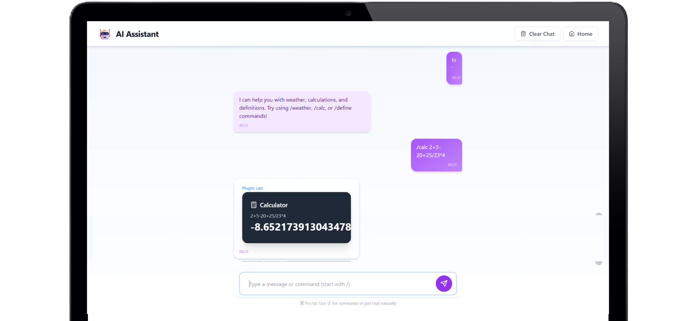

# 🤖 AI Assistant Chatbot

Welcome to **AI Assistant** – a modern, extensible, and visually stunning AI-powered chatbot interface built with React, TypeScript, and Tailwind CSS!

---

## ✨ What is this project?

This project is a **next-generation AI chatbot interface** featuring:
- 🧩 **Plugin system**: Weather, Calculator, Dictionary, and more!
- 💬 **Natural language understanding**: Ask questions like "What's the weather in Tokyo?" or "Define serendipity".
- 🎨 **Beautiful UI/UX**: Modern chat bubbles, glassmorphism, smooth animations, and a jaw-dropping landing page.
- 💾 **Persistent chat history**: Your conversations are saved locally.
- ⚡ **Lightning-fast**: Built with React 18, Vite, and Tailwind CSS.

---

## 🚀 Features

- **Landing Page**: Eye-catching, animated, and responsive with a purple theme.
- **Chat UI**:
  - User and assistant messages in beautiful purple chat bubbles.
  - Plugin responses as rich cards (weather, calculator, dictionary, etc).
  - Typing indicator, command suggestions, and keyboard navigation.
- **Plugin System**:
  - `/weather [city]` – Get real-time weather.
  - `/calc [expression]` – Powerful calculator.
  - `/define [word]` – Dictionary with audio, synonyms, and more.
  - Easily add your own plugins!
- **Natural Language Routing**: Just ask, and the right plugin is triggered.
- **Dark/Light Mode Ready**: Easily themeable.
- **Responsive**: Works beautifully on desktop and mobile.

---

## 🗂️ Folder Structure

```
.
├── public/                # Static assets
├── src/
│   ├── components/        # React UI components
│   │   ├── ChatUI.tsx
│   │   ├── LandingPage.tsx
│   │   ├── CommandInput.tsx
│   │   └── ...
│   ├── plugins/           # Plugin system
│   │   ├── PluginManager.ts
│   │   ├── calculator/
│   │   ├── weather/
│   │   ├── dictionary/
│   │   └── ...
│   ├── store/             # State management (Zustand)
│   ├── hooks/             # Custom React hooks
│   ├── context/           # React context providers
│   ├── types/             # TypeScript types
│   ├── index.css          # Tailwind & global styles
│   └── App.tsx            # App entry point
├── package.json
├── tailwind.config.js
└── README.md
```

---

## 🛠️ Getting Started

1. **Install dependencies**
   ```bash
   npm install
   ```

2. **Start the development server**
   ```bash
   npm run dev
   ```

3. **Open your browser**
   - Visit [http://localhost:5173](http://localhost:5173)

---

## 🧩 Adding Your Own Plugins

1. Create a new folder in `src/plugins/`.
2. Implement the `Plugin` interface (see existing plugins for examples).
3. Register your plugin in `PluginManager.ts`.
4. (Optional) Add natural language patterns in `parseMessage`.

---

## 💡 Example Plugin Commands

- `/weather London`
- `/calc 2+2*5`
- `/define ephemeral`
- Or just ask:
  - "What's the weather in Paris?"
  - "Define serendipity"
  - "Calculate 5*10+2"

---

## 🖼️ Screenshots




---

## 📝 License

MIT

---

> Made with ❤️ and ☕ by [Vipul Katwal]
